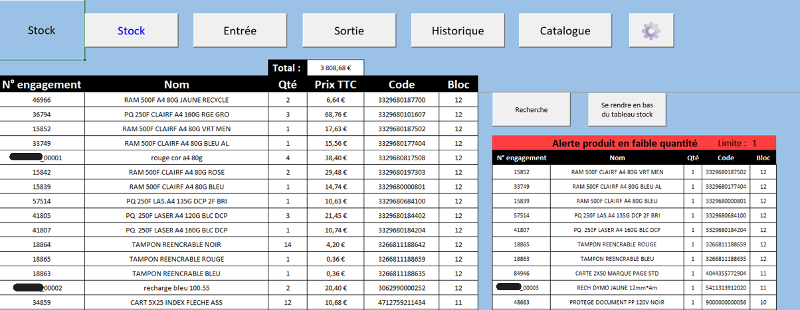
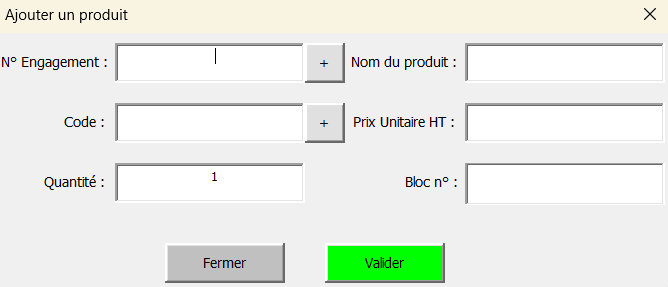
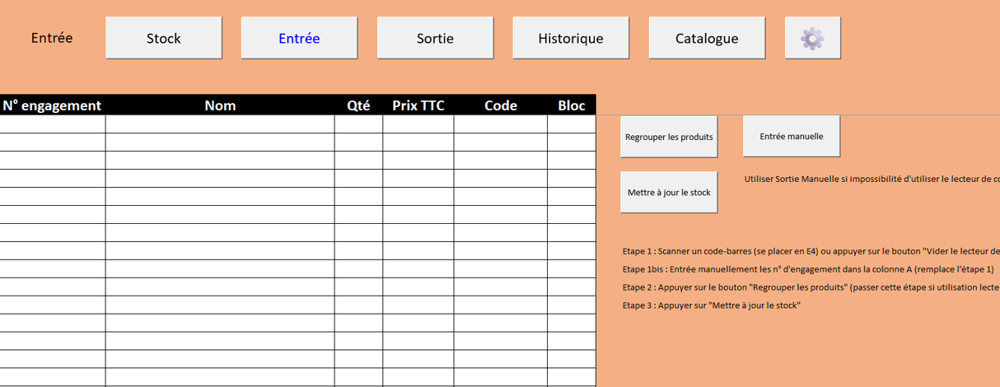
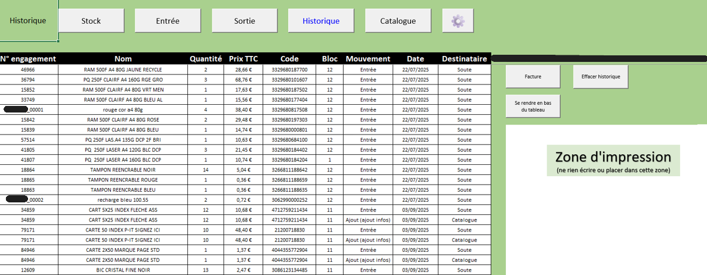

# Outil de gestion de stock – Excel VBA

##  Description

Ce projet consiste en le développement d’un outil de gestion de stock automatisé sous Excel VBA, réalisé dans un contexte professionnel.

L’objectif principal était de remplacer une gestion manuelle sur support papier par une solution fiable, rapide et intuitive, permettant le suivi en temps réel des fournitures, la traçabilité des mouvements et l’automatisation des opérations de gestion.

L’outil intègre un système de lecture de codes-barres, des formulaires interactifs et une logique de traitement des données permettant de gérer l’ensemble du cycle de vie des produits : entrée, stockage, sortie et historisation.

Le projet a été conçu en prenant en compte des contraintes techniques fortes (environnement sécurisé, absence d’accès internet, limitations logicielles), ce qui a orienté les choix technologiques vers une solution 100% autonome basée sur Excel et VBA.

---

##  Contraintes et choix techniques

- Environnement sans accès internet
- Interdiction des technologies sans fil
- Utilisation d’un lecteur de code-barres filaire
- Développement 100% sous Excel VBA

Ces contraintes ont orienté le projet vers une solution robuste, autonome et adaptée à un environnement sécurisé.

---

##  Fonctionnalités principales

-  Recherche multi-critères (nom, code, engagement)
-  Ajout de produits via formulaire interactif
-  Modification et suppression sécurisées
-  Gestion des entrées et sorties de stock
-  Mise à jour automatique des quantités
-  Détection des produits inconnus avec ajout assisté
-  Système de confirmation paramétrable

---

##  Architecture

- Catalogue produits (base de référence)
- Table stock (suivi des quantités)
- Table entrées / sorties
- Formulaires VBA pour interaction utilisateur
- Contrôles de cohérence (doublons, validations)

---

##  Workflow global

Ce schéma représente le fonctionnement global du système de gestion de stock.

Le processus s’articule autour de plusieurs étapes clés :

- Scan ou saisie d’un produit (entrée / sortie)  
- Vérification dans le catalogue  
- Ajout automatique si produit inconnu  
- Mise à jour du stock en temps réel  
- Enregistrement dans l’historique  
- Gestion spécifique des sorties (choix du destinataire)  
- Détection des niveaux de stock faibles  

Ce fonctionnement permet d’assurer une gestion fiable, automatisée et traçable des flux de produits.

---

##  Technologies utilisées

- Microsoft Excel
- VBA (UserForms, macros, modules)
- Logique de gestion de données (type base relationnelle simplifiée)

---

##  Aperçu du fonctionnement

###  Vue globale du stock

Cette interface permet d’avoir une vision globale des produits disponibles, avec pour chaque article : son nom, sa quantité, son prix et sa localisation.  
Elle constitue le cœur du système, où toutes les données sont centralisées et mises à jour automatiquement.

---

###  Ajout de produit via formulaire

Lorsqu’un produit n’est pas reconnu dans le catalogue, un formulaire interactif permet de l’ajouter rapidement.  
Ce formulaire intègre des contrôles de validation (format des données, unicité, cohérence), garantissant la fiabilité des informations enregistrées.

---

###  Mise à jour du stock (entrée / sortie)

Les produits sont ajoutés ou retirés du stock via un système de scan de codes-barres.  
Les données sont automatiquement regroupées, traitées puis intégrées au stock, avec mise à jour des quantités et enregistrement dans l’historique.

---

###  Suivi et traçabilité (historique)

Chaque mouvement de stock (entrée ou sortie) est enregistré avec sa date et sa destination.  
Cela permet d’assurer une traçabilité complète et de générer des documents de suivi (ex : factures ou consommation).

---

##  Confidentialité

Ce projet a été réalisé dans un contexte professionnel.  
Pour des raisons de confidentialité, le code source complet ne peut pas être publié.

Les éléments présentés (captures, description, architecture) reflètent fidèlement les fonctionnalités développées.

---

##  Améliorations possibles

- Connexion à une base de données SQL  
- Interface web ou application dédiée  
- Dashboard de suivi (Power BI)  
- Intégration IoT / scan automatisé  

---

##  Auteur

Projet réalisé par Martin WITTMANN
