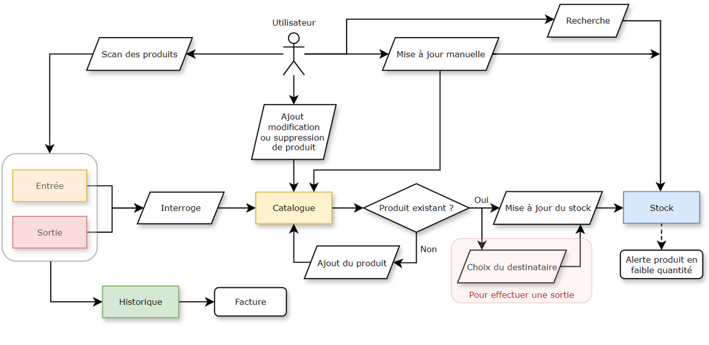
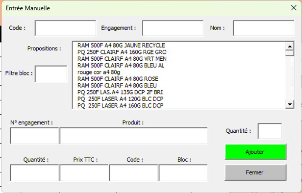
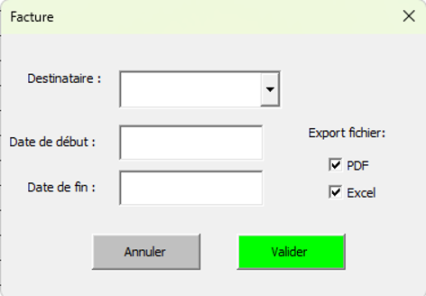
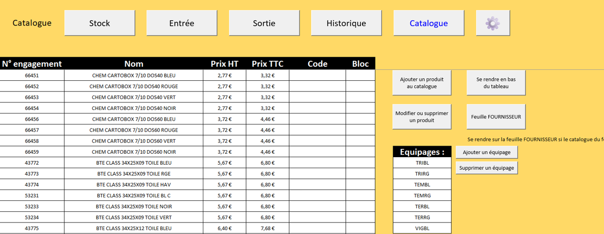
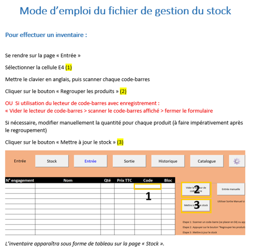

# Outil de gestion de stock – Excel VBA

##  Description
Développement d’un outil de gestion de stock automatisé sous Excel VBA, conçu pour améliorer la traçabilité, la fiabilité des données et l’efficacité des opérations.

Ce projet s’appuie sur une logique de structuration des données et d’automatisation des traitements, avec une interface utilisateur basée sur des formulaires dynamiques.

---

##  Fonctionnalités principales

-  Recherche multi-critères (nom, code, engagement)
-  Ajout de produits via formulaire interactif
-  Modification et suppression sécurisées
-  Gestion des entrées et sorties de stock
-  Mise à jour automatique des quantités
-  Détection des produits inconnus avec ajout assisté
-  Système de confirmation paramétrable

---

##  Architecture

- Catalogue produits (base de référence)
- Table stock (suivi des quantités)
- Table entrées / sorties
- Formulaires VBA pour interaction utilisateur
- Contrôles de cohérence (doublons, validations)

---

##  Workflow

1. Saisie ou scan du code produit  
2. Vérification dans le catalogue  
3. Si produit inconnu → ouverture du formulaire d’ajout  
4. Mise à jour automatique du stock  
5. Regroupement et mise à jour des quantités
6. Historisation de chaque action
7. Génération de facture (.pdf et/ou .xlsx)  

---

##  Technologies utilisées

- Microsoft Excel
- VBA (UserForms, macros, modules)
- Logique de gestion de données (type base relationnelle simplifiée)

---

##  Aperçu

### Présentation générale de l'outil

### Feuille "Stock"
 

### Feuille "Entrée"

### Formulaire : Entrée manuelle de produit dans le stock

### Feuille "Historique"

### Formulaire : Facture

### Feuille "Catalogue"

### formulaire : Modification ou suppression d'un produit dans le catalogue

### Feuille "Paramètres"

### Extrait du mode d'emploi

---

##  Confidentialité

Ce projet a été réalisé dans un contexte professionnel.  
Pour des raisons de confidentialité, le code source complet ne peut pas être publié.

Les éléments présentés (captures, description, architecture) reflètent fidèlement les fonctionnalités développées.

---

##  Améliorations possibles

- Connexion à une base de données SQL  
- Interface web ou application dédiée  
- Dashboard de suivi (Power BI)  
- Intégration IoT / scan automatisé  

---

##  Auteur

Projet réalisé par Martin WITTMANN
